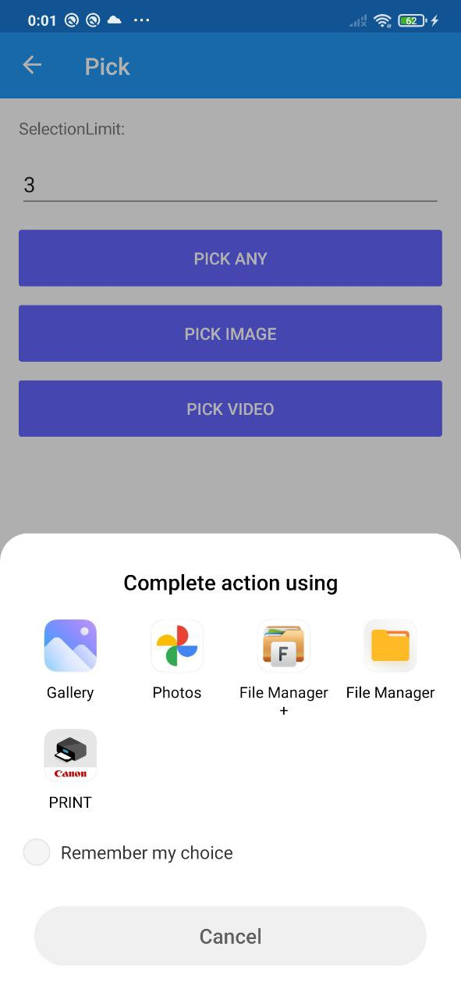
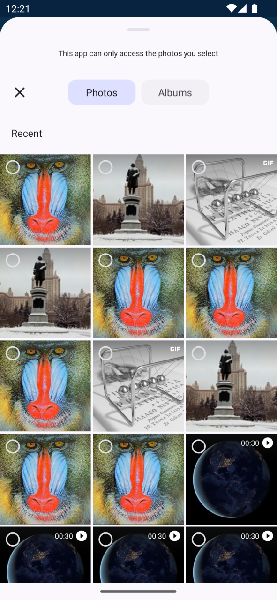

# MediaGallery for Xamarin and MAUI


[](https://www.nuget.org/packages/Xamarin.MediaGallery/) [](https://www.nuget.org/packages/Xamarin.MediaGallery/) [](./LICENSE) [](https://www.fuget.org/packages/Xamarin.MediaGallery) [](https://youtu.be/8JvgnlHVyrI)

This plugin is designed for picking and saving photos and video files from the native gallery of Android and iOS devices and capture photo.

 [](https://www.buymeacoffee.com/dimonovdd)


 ## FAQ

 Please read this file and see samples before creating an issue.

### Q: [I can't build Xamarim.MediaGallery solution. Why?](https://github.com/dimonovdd/Xamarin.MediaGallery/issues/98#issuecomment-1103067533)
**A:** Sorry, it became very difficult after adding support for MAUI, but you can build `Xamarim.MediaGallery.Sample.sln` or `Xamarim.MediaGallery.Sample.Maui.sln`

### Q: [Why does a image have wrong orientation?](https://github.com/dimonovdd/Xamarin.MediaGallery/issues/105)
**A:** This is correct behavior. The plugin returns images without any changes, See [metadata](https://www.nuget.org/packages/MetadataExtractor/)

### Q: [How do I get `FilePath`?](https://github.com/dimonovdd/Xamarin.MediaGallery/issues/104)
**A:** It is not possible. [But you can copy a file to a cache directory](./Sample/Common/src/Helpers/FilesHelper.cs#L8)

### Q: [How does Xamarin.MediaGallery work on a PopupPage from Rg.Plugins.Popup?](https://stackoverflow.com/questions/70233374/how-does-xamarin-mediagallery-work-in-popuppage-in-xamarin)
**A:** Fine! But you need to [initialize the plugin](#ios-optional) on iOS. [See taht sample code](https://github.com/xamarin/Essentials/pull/1846#issuecomment-975207765)

### Q: [Why an error thrown when picking a image on a iOS simulator?](https://github.com/dimonovdd/Xamarin.MediaGallery/issues/92)
**A:** This issue is on Apple side

## Available Platforms

| Platform | Minimum OS Version |
| --- | --- |
| Android | 5.0 |
| iOS | 11.0 |

### TargetFrameworks

- `net6.0-ios`, `net6.0-android31.0`, `net6.0-android32.0`, `net6.0-android33.0`
- `netstandard2.0`, `Xamarin.iOS10`, `MonoAndroid10.0`, `MonoAndroid11.0`, `MonoAndroid12.0`, `MonoAndroid13.0`

## Getting started

You can just watch the [Video](https://youtu.be/8JvgnlHVyrI) that [@jfversluis](https://github.com/jfversluis) published

[**Migration to 2.X.X version**](./docs/migration2.x.x.md)

### Android

In the Android project's MainLauncher or any Activity that is launched, this plugin must be initialized in the OnCreate method:

```csharp
protected override void OnCreate(Bundle savedInstanceState)
{
    //...
    base.OnCreate(savedInstanceState);
    NativeMedia.Platform.Init(this, savedInstanceState);
    //...
}
 ```

### iOS (Optional)

In the iOS project's AppDelegate that is launched, this plugin can be initialized in the FinishedLaunching method:

```csharp
public override bool FinishedLaunching(UIApplication app, NSDictionary options)
{
    NativeMedia.Platform.Init(GetTopViewController);
    global::Xamarin.Forms.Forms.Init();
    LoadApplication(new App());
    return base.FinishedLaunching(app, options);
}

public UIViewController GetTopViewController()
{
    var vc = UIApplication.SharedApplication.KeyWindow.RootViewController;

    if (vc is UINavigationController navController)
        vc = navController.ViewControllers.Last();

    return vc;
}
 ```

## PickAsync

This method does not require requesting permissions from users

```csharp
var cts = new CancellationTokenSource();
IMediaFile[] files = null;

try
{
    var request = new MediaPickRequest(1, MediaFileType.Image, MediaFileType.Video)
    {
        PresentationSourceBounds = System.Drawing.Rectangle.Empty,
        UseCreateChooser = true,
        Title = "Select"
    };

    cts.CancelAfter(TimeSpan.FromMinutes(5));

    var results = await MediaGallery.PickAsync(request, cts.Token);
    files = results?.Files?.ToArray();
}
catch (OperationCanceledException)
{
    // handling a cancellation request
}
catch (Exception)
{
    // handling other exceptions
}
finally
{
    cts.Dispose();
}


if (files == null)
    return;

foreach (var file in files)
{
    var fileName = file.NameWithoutExtension; //Can return an null or empty value
    var extension = file.Extension;
    var contentType = file.ContentType;
    using var stream = await file.OpenReadAsync();
    //...
    file.Dispose();
}
 ```

 This method has two overloads:

- `Task<MediaPickResult> PickAsync(int selectionLimit = 1, params MediaFileType[] types)`
- `Task<MediaPickResult> PickAsync(MediaPickRequest request, CancellationToken token = default)`

### Android

 To handle runtime results on Android, this plugin must receive any `OnActivityResult`.

 ```csharp
protected override void OnActivityResult(int requestCode, Result resultCode, Intent intent)
{
    if (NativeMedia.Platform.CheckCanProcessResult(requestCode, resultCode, intent))
    NativeMedia.Platform.OnActivityResult(requestCode, resultCode, intent);
    
    base.OnActivityResult(requestCode, resultCode, intent);
}
 ```

 If an app has `android:targetSdkVersion="33"` or greater [new Photo picker](https://developer.android.com/training/data-storage/shared/photopicker) will be used if possible.

 #### Default behavior

- When using `PickAsync` method `selectionLimit` parameter just sets multiple pick allowed
- A request to cancel `PickAsync` method will cancel a task, but the picker UI can remain open until it is closed by the user
- The use of `Title` property depends on each device
- `UseCreateChooser` property has not been used since version 2.0.0

#### Photo Picker behavior

- `selectionLimit` parameter limits the number of selected media files
- `Title` property not used
- `UseCreateChooser` property not used

### iOS

- Multi picking is supported since iOS version 14.0+ On older versions, the plugin will prompt the user to select a single file
- The `NameWithoutExtension` property on iOS versions before 14 returns a null value if the permission to access photos was not granted
- `Title` property not used
- `UseCreateChooser` property not used

#### Presentation Location

When picking files on iPadOS you have the ability to present in a pop over control. This specifies where the pop over will appear and point an arrow directly to. You can specify the location using the `PresentationSourceBounds` property. Setting this property has the same behavior as [Launcher or Share in Xamarin.Essentials](https://docs.microsoft.com/en-us/xamarin/essentials/share?tabs=android#presentation-location).

`PresentationSourceBounds` property takes `System.Drawing.Rectangle` for `Xamarin` or `Microsoft.Maui.Graphics.Rect` for `.net6(MAUI)`

**Screenshots:**

- [Popover](./Screenshots/iPadPopover.png)
- [PageSheet](./Screenshots/iPadPageSheet.png)

## Сapture Photo with Metadata

```csharp
//...
if (!MediaGallery.CheckCapturePhotoSupport())
    return;

var status = await Permissions.RequestAsync<Permissions.Camera>();

if (status != PermissionStatus.Granted)
    return;

using var file = await MediaGallery.CapturePhotoAsync()
 ```

`NameWithoutExtension` will always return `$"IMG_{DateTime.Now:yyyyMMdd_HHmmss}"` value.

### Android

Open the AndroidManifest.xml file under the Properties folder and add the following inside of the manifest node.

```xml
<uses-permission android:name="android.permission.CAMERA" />
```

```xml
<uses-feature android:name="android.hardware.camera" android:required="true" />
```
If Camera is not required in your application, you can specify `false`.

```xml
<queries>
  <intent>
    <action android:name="android.media.action.IMAGE_CAPTURE" />
  </intent>
</queries>
```


### iOS

In your `Info.plist` add the following keys:

 ```xml
<key>NSCameraUsageDescription</key>
<string>This app needs access to the camera to take photos.</string>
 ```

## SaveAsync

```csharp
//...
var status = await Permissions.RequestAsync<SaveMediaPermission>();

if (status != PermissionStatus.Granted)
    return;

await MediaGallery.SaveAsync(MediaFileType.Video, filePath);

//OR Using a byte array or a stream

await MediaGallery.SaveAsync(MediaFileType.Image, stream, fileName);

//The name or the path to the saved file must contain the extension.

//...
 ```

### Permission

Add [`Xamarin.MediaGallery.Permision`](https://www.nuget.org/packages/Xamarin.MediaGallery.Permision) or [`Xamarin.MediaGallery.Permision.Maui`](https://www.nuget.org/packages/Xamarin.MediaGallery.Permision.Maui) nuget package to use the `SaveMediaPermission`

### Android

Open the AndroidManifest.xml file under the Properties folder and add the following inside of the manifest node.

 ```xml
<!-- for saving photo/video -->
<uses-permission android:name="android.permission.WRITE_EXTERNAL_STORAGE" />
 ```

- When saving media files, the date and time are appended to the file name

### iOS

In your `Info.plist` add the following keys:

 ```xml
<!-- for saving photo/video on iOS 14+ -->
<key>NSPhotoLibraryAddUsageDescription</key>
<string>This app needs access to the photo gallery for saving photos and videos</string>

<!-- for saving photo/video on older versions -->
<key>NSPhotoLibraryUsageDescription</key>
<string>This app needs access to the photo gallery for saving photos and videos</string>
 ```

## Screenshots

|   iOS   | Android - Defult  | Android - Photo Picker |
|:-------:|:-------:|:-------:|
||||